# ChiXiao（赤霄）

<p align="center">
  <a href="https://wails.io/"></a>
  <a href="https://go.dev/"></a>
  <a href="https://vuejs.org/"></a>
  <a href="https://opensource.org/licenses/MIT"></a>
</p>

<p align="center">
  <strong>现代化红队攻防综合平台 / 本地化安全工具工作台</strong>
</p>

---

## 1. 项目定位

**ChiXiao（赤霄）** 是一款面向红队工程师、渗透测试人员与安全研究人员的本地桌面平台。

它不是单一工具，而是一个把 **工具管理、信息收集、漏洞验证、攻防辅助、日志分析、应急研判** 聚合到同一界面的安全工作台，核心目标是：

- 把常用安全工具统一纳管，避免"桌面一堆 exe / bat / python 脚本"难维护；
- 把高频攻防操作整合到一个连续工作流中，减少上下文切换；
- 把本地分析、规则研判、AI 辅助和结果沉淀放在同一个产品内完成。

如果你想要的是一个 **"个人数字化武器库"**，ChiXiao 就是为这个目标设计的。

---

## 2. 导航模块一览

左侧导航共 **7 大模块**，覆盖红队工作全流程：

| 模块 | 说明 |
|---|---|
| **应用启动器** | 工具目录 + 工具市场(44内置) + 分类侧栏 + 仓库更新监控联动 |
| **信息收集** | 企业信息 / ICP备案 / 网络归属 / 空间测绘 / 目录扫描 / Naabu端口扫描 / HTTP探测 / Subfinder子域名 / JSFinder / Google Hack |
| **漏洞管理** | POC管理 / Nuclei扫描 / Repeater请求重发 |
| **攻防赋能** | 反弹Shell / 杀软识别 / 补丁检测 / Java编码 / AK泄露检测 / 口令爆破(16+协议) / Dumpall源码泄漏 |
| **网址导航** | 安全站点导航 |
| **临时笔记** | Markdown草稿，自动保存 |
| **辅助工具** | 默认密码 / CyberChef(数据处理) / 随机生成 / 备忘录 / 仓库更新 / 设置 |

---


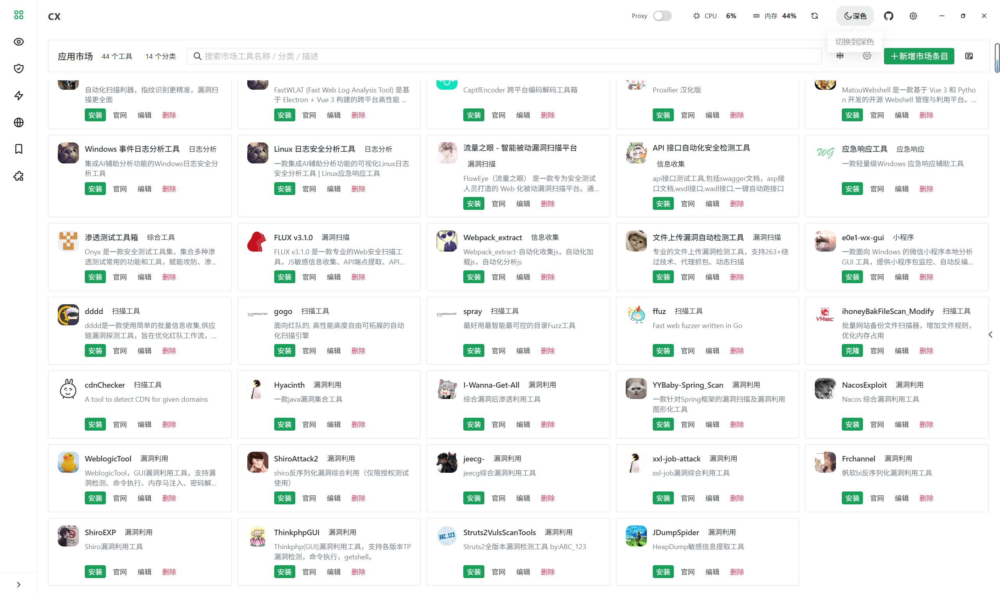

卡片显示更新角标（`v1.0 → v2.0`）

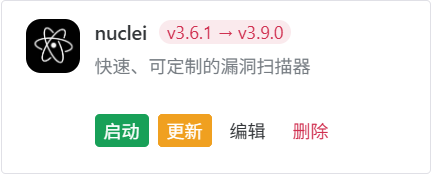


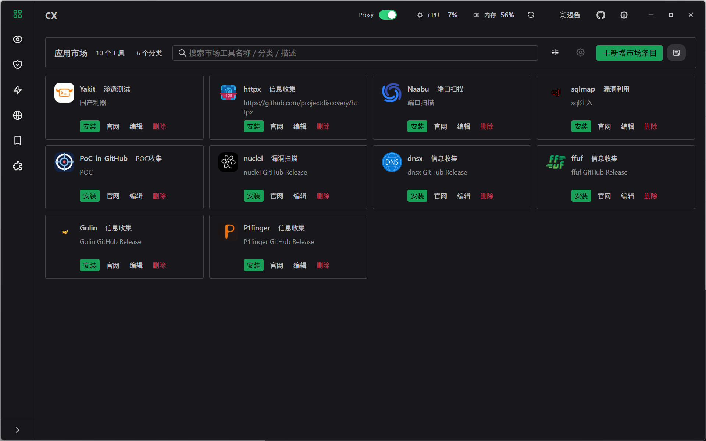


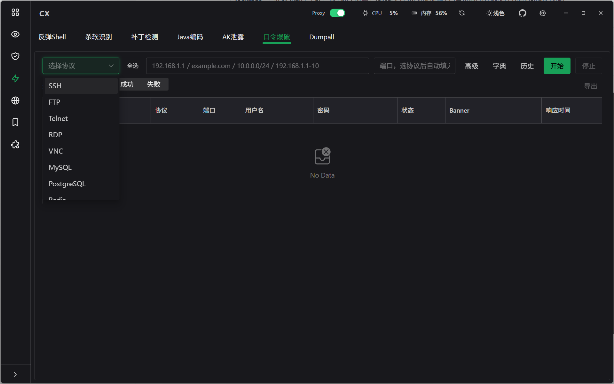


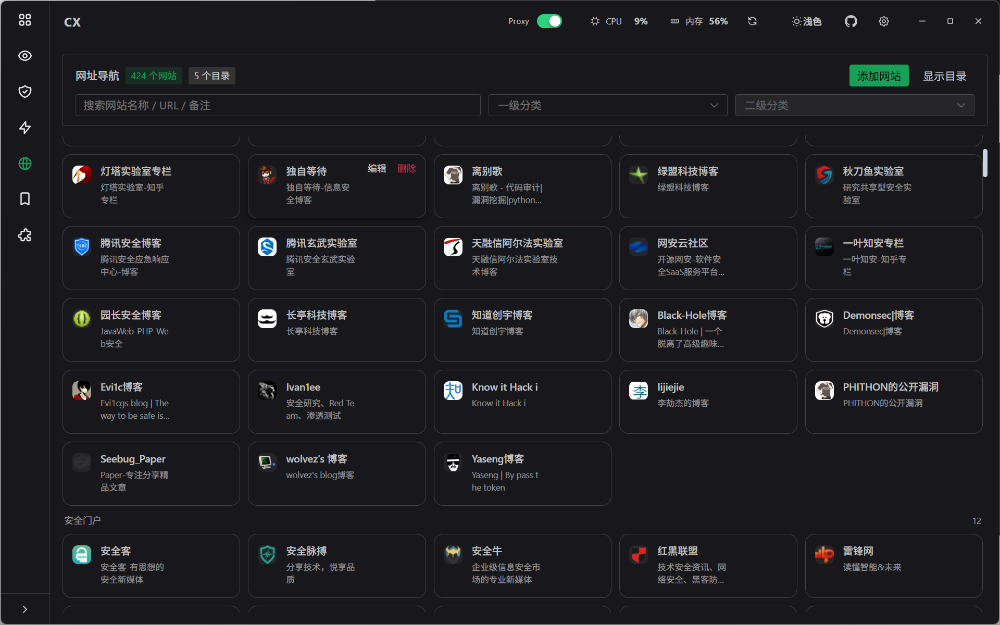


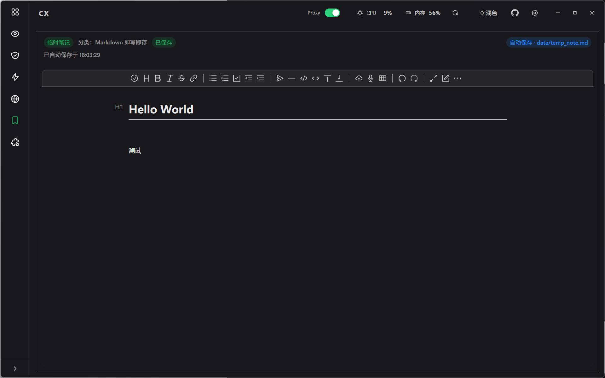


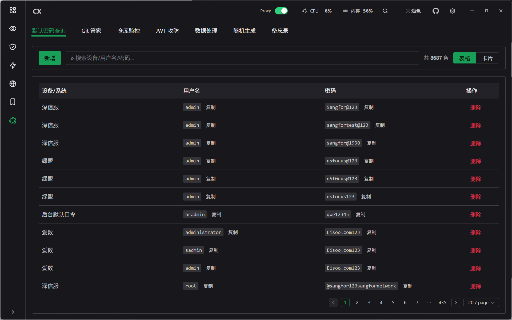


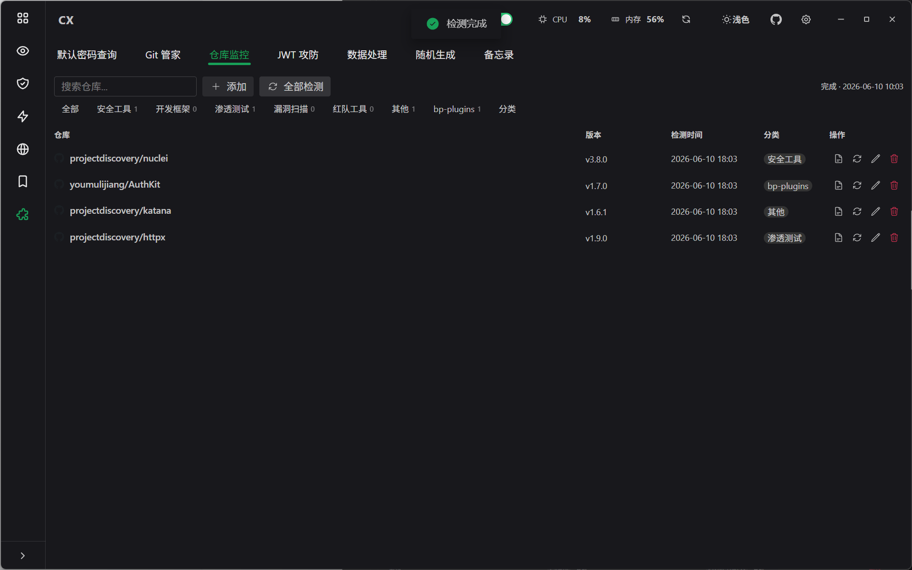

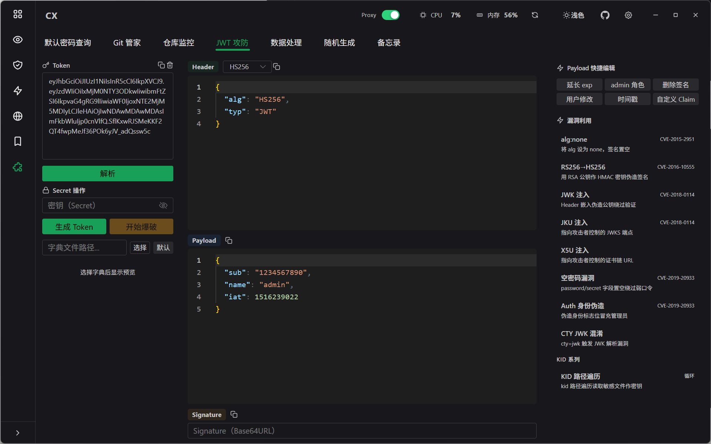


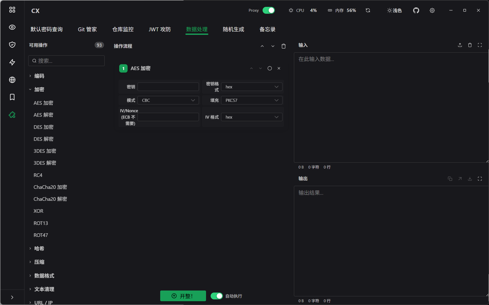


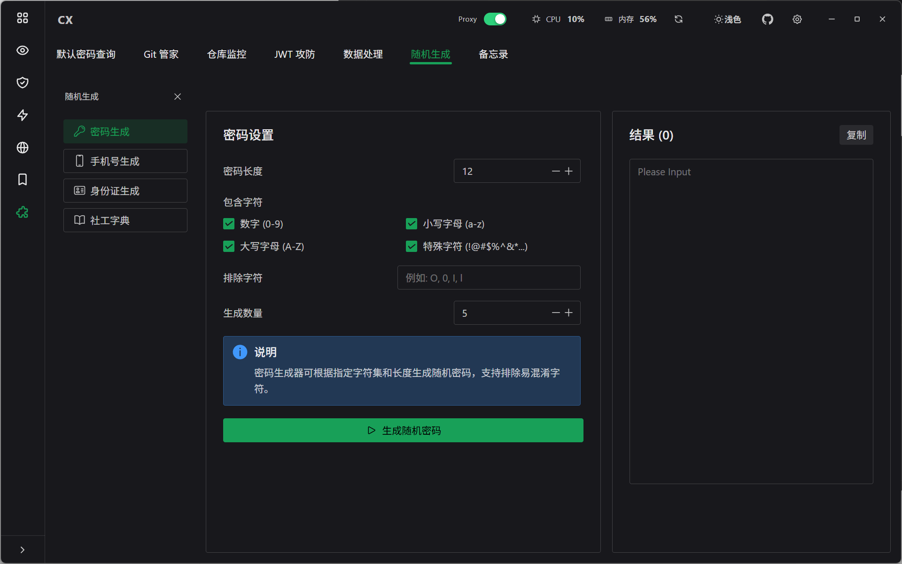

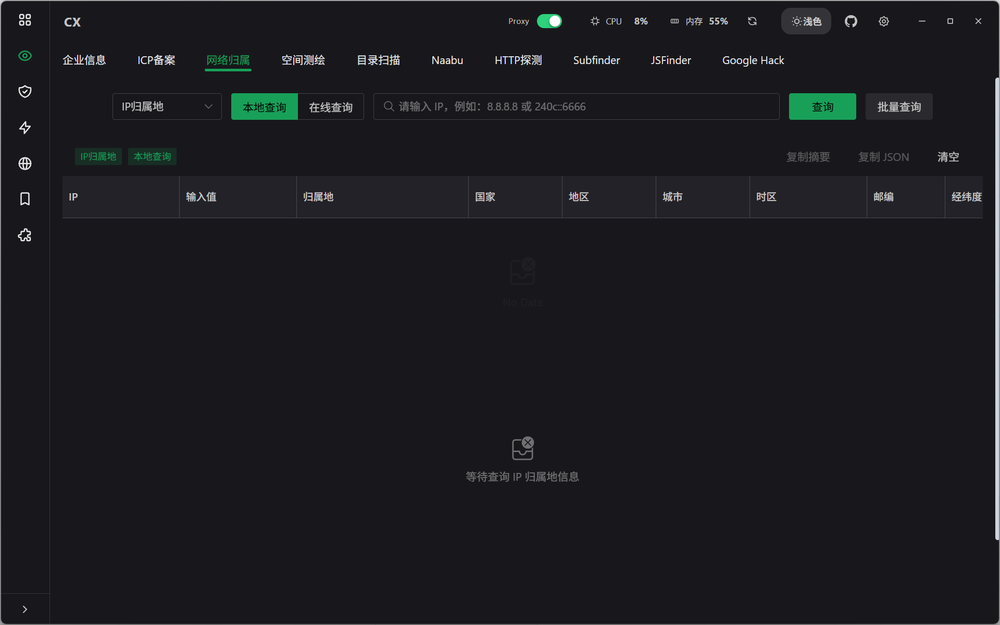


## 3. 核心能力详解

### 3.1 信息收集

| 功能 | 说明 |
|---|---|
| **企业信息** | 爱企查工商数据，股东与对外投资查询 |
| **ICP备案** | 网站 / APP / 小程序 / 快应用备案查询 |
| **网络归属** | IP归属地、域名RDAP查询 |
| **空间测绘** | FOFA / Quake / Hunter三大引擎聚合 |
| **目录扫描** | 字典扫描 + 备份文件探测，支持历史复用 |
| **Naabu** | 端口发现 + 服务识别 + 结果联动 |
| **HTTP探测** | 可达性、标题指纹、跳转识别 |
| **Subfinder** | 被动子域名枚举（基于 subfinder v2.14.0） |
| **JSFinder** | JS资源采集 + 敏感字段提取 + API风险探测 |
| **Google Hack** | 搜索引擎语法检索 |

### 3.2 漏洞管理

| 功能 | 说明 |
|---|---|
| **漏洞检测** | POC管理 + Nuclei扫描任务编排 |
| **Repeater** | 请求重发与调试 |

### 3.3 攻防赋能

| 功能 | 说明 |
|---|---|
| **反弹Shell** | 多环境反弹Shell命令生成（Linux / Windows / Python / PHP / Java / Perl / Ruby / Go / Powershell / Bash / nc 等） |
| **杀软识别** | 基于进程列表识别 AV / EDR 产品（Windows Defender / 卡巴斯基 / 麦咖啡 / 赛门铁克 / 火绒 / 360 等） |
| **补丁检测** | 基于 systeminfo / QFE 文本识别缺失候选补丁 |
| **Java编码** | Runtime.exec Payload 生成 |
| **AK泄露检测** | 多平台 AK / Token / Secret 校验（阿里云 / 腾讯云 / 百度云 / AWS / GCP / Azure / Google Maps / 高德 /等 |
| **口令爆破** | 16+ 协议弱口令（SSH / FTP / MySQL / MSSQL / RDP / Redis / MongoDB / PostgreSQL / SMB / Telnet / VNC / Memcached / Elasticsearch / Kerberos / SMTP / POP3） |
| **Dumpall** | .DS_Store / .git / .svn 泄漏利用与源代码恢复 |

### 3.4 数据处理（CyberChef 本地替代）

**数据处理** 是 ChiXiao 的瑞士军刀模块，提供 **100+ 管道式操作**，支持拖拽串联、多步骤连续处理。

| 分类 | 代表操作 |
|------|----------|
| **编码 / 解码** | Base64/32/58/62/85/91、Hex、URL Encode、HTML Entity、Unicode、Punycode |
| **哈希 / 校验** | MD5、SHA1/2/3、BLAKE2/3、HMAC、CRC32、NT Hash |
| **加密 / 解密** | AES、DES、3DES、RC4、ChaCha20、XOR、Blowfish |
| **压缩 / 解压** | Gzip、Zlib、Bzip2、Raw Deflate、Tar |
| **文本处理** | Diff 对比、Pattern Filter、大小写、排序去重、正则替换、命名格式转换 |
| **数据提取** | IP/URL/域名/C段提取、IP 格式互转、CIDR 展开、计数统计 |
| **格式转换** | JSON/XML/JS 美化压缩、时间戳互转、中文过滤、URL 清洗 |
| **特殊处理** | 空白字符清洗、端序转换 |

---

### 3.5 JWT 攻防台

| 功能 | 说明 |
|---|---|
| Token 解析 | Header / Payload 自动解析 |
| 签名验证 | 支持 HS256 / HS384 / HS512 / RS256 / RS384 / RS512 / ES256 / ES384 / ES512 |
| 密钥测试 | 支持 HMAC 对称密钥与 RSA/ECDSA 非对称密钥 |
| 常用攻击 | None 算法攻击 / 密钥混淆 / RS/HS 签名切换 |

---

## 4. 快捷键

| 快捷键 | 功能 |
|---|---|
| `Ctrl + K` | 打开全局功能搜索（支持别名搜索，如输入"企业查询"直达企业信息页） |
| `Ctrl + B` | 折叠 / 展开左侧导航 |

---

## 5. 顶部栏与代理说明

### 顶部栏功能
- 应用品牌与窗口控制
- 全局代理开关
- 系统资源监控（CPU / 内存）
- 主题切换（浅色 / 深色 / 跟随系统）
- 设置入口
- 项目仓库入口

### 全局代理
- 顶部栏中的 **Proxy** 开关只控制"是否启用代理"，不负责编辑地址；
- 代理地址在"设置 -> 环境变量配置"中维护；
- 如果未配置代理地址却尝试开启代理，应用会引导你先进入设置填写；
- 关闭代理时，不会清空地址，只是停止通过代理转发请求。

---

## 6. 技术架构

### 前端
- Vue 3 + Vite + TypeScript
- Naive UI（主题单一真源）
- Pinia 状态管理
- Monaco Editor（HTTP/YAML编辑）
- Vditor（Markdown编辑）

### 后端
- Go 1.24+（无 CGO 纯 Go 依赖）
- Wails v2（WebView2 原生桌面壳）
- 现代密码学库（bcmul / aes / chacha20 等）

### 数据层
- 本地 SQLite（modernc.org/sqlite，纯 Go 无 CGO）
- AES 加密存储敏感字段

### 外部工具集成
nuclei / subfinder / naabu / httpx / dirsearch / chromedp 等

### 项目结构

```
ChiXiao/
├─ frontend/                # Vue 3 前端
│  ├─ src/
│  │  ├─ components/      # 通用组件
│  │  ├─ pages/           # 页面级功能模块（含 Emergency 应急响应子目录）
│  │  ├─ ui/              # AppShell / TopBar / SideNav 等壳层 UI
│  │  └─ stores/          # Pinia 状态管理
├─ backend/                 # Go 服务层
│  ├─ services/           # Wails 绑定服务（30+ 服务文件，约 34000 行）
│  ├─ config/             # 配置读写
│  ├─ models/             # 数据模型
│  └─ brute_protocols/    # 口令爆破协议实现
├─ data/                    # 本地运行数据
├─ main.go                  # Wails 入口
└─ README.md
```

---

## 7. 快速开始

### 运行环境
- Windows 10/11 x64
- WebView2 运行时（Wails 自动绑定）

### 使用方式
下载发布版本并解压后即可运行。

```
ChiXiao/
├── ChiXiao.exe
└── data/
    ├── data.db
    └── GeoLite2-City.mmdb   （可选，用于 IP 地理位置）
```

---

## 8. 开发环境

### 依赖要求
- Go：1.24+
- Node.js：18+
- Wails CLI：`go install github.com/wailsapp/wails/v2/cmd/wails@latest`


---

## 9. 更新日志

### v2.4

> **启动器 × 仓库监控联动 + Git Clone + 内置市场 + 安装弹窗重设计**

**新功能**

- **启动器 × 仓库监控联动** — 本地工具关联 GitHub 仓库，卡片显示更新角标（`v1.0 → v2.0`），一键下载更新到原路径；支持手动填写版本号/关联仓库，可开关单个工具的更新监控
- **Git Clone 安装类型** — 新增 `gitClone` 安装方式，无 Release 的仓库直接 `git clone --depth 1`，更新时 `git pull`；CMD 窗口自动隐藏，版本用 `describe --tags --always`
- **内置应用市场** — 首次启动自动导入 **44 个预置安全工具**（Yakit / httpx / Naabu / nuclei / sqlmap / ddddd / gogo / ShiroAttack2 等），覆盖信息收集、漏洞扫描、漏洞利用、日志分析
- **市场图标本地化** — GitHub 仓库主人头像 embed 到二进制，启动时释放到 `data/market_icons/`，离线可用
- **应用市场分类侧栏** — 可折叠目录大纲，默认折叠，点击分类筛选
- **仓库监控增强** — 新增「更新时间」列，`market_item_id` 关联市场条目

**安装弹窗重设计**

- 彩色图标头部（4 种安装类型不同颜色），去边框圆角块布局
- 更新模式版本对比横幅，结果区绿色打勾
- 下载超时 30s → 30min，超时报错人性化

**Bug 修复**

- 修复 `UpdateToolVersion` 死锁（双重 Lock 导致按钮永久转圈）
- 修复关闭弹窗后台操作继续执行导致数据损坏
- 修复更新后出现重复工具卡片
- 修复应用市场无法滚动（flex 布局链 + box-sizing）
- 修复编辑保存后需重载才显示更新提示
- 修复首次启动市场不显示（`createDefaultConfig` 未走 `validateConfig`）
- 首次启动无本地工具时默认打开应用市场
- 应用市场删除确认改用 Naive UI 对话框

### v2.3


**重构 / 优化**

- **深色主题全覆盖** — 修复请求重放 (Repeater) Request/Response Monaco 编辑器在深色模式下背景仍为白色的 Bug，HTTP 语法高亮配色正确跟随主题切换
- **AI 智能分析配置** — 暂时禁用设置面板中的 AI 配置 Tab（当前功能未使用 AI），后续添加模型接口时重新启用

###  v2.2

1. 优化网络归属中IP138反查功能bug
2. 本项目仍在持续迭代中，Bug 一定不少，欢迎在 [Issues](https://github.com/z50n6/ChiXiao/issues) 中提出。

### v2.1

> **信息收集 + 指纹引擎全面升级，服务检测与 Git 管家重构**

**新功能 / 能力增强**

- **Naabu + HTTPX 指纹引擎** — 三层渐进式识别：fingerprintx（TCP 服务指纹）+ Wappalyzer（技术栈）+ EHole finger.json（900+ CMS 规则），大幅提升 Web 资产识别精度
- **网络归属** — IP138 反查接入 chromedp 渲染引擎，解决「当前解析」列数据缺失；IP 归属地支持在线 / 本地双模查询
- **服务未授权检测** — 补齐至 14 协议（Redis / MySQL / PostgreSQL / MongoDB / SSH / FTP / Elasticsearch / RabbitMQ / SQL Server / SMB / WMI / MQTT / Oracle / Zookeeper），结果深度对齐来源项目

**重构 / 优化**

- **Git 管家** — 数据存储从 JSON Blob 迁移到结构化 SQLite 表，并发采集元数据，UI 颜色区分仓库状态
- **备忘录** — UI 完全重写
- **工具箱** — 修复拖拽导入与图标稳定性，完善路径选择与启动逻辑
- 企业信息支持 JSON 导出，公众号数据获取优化
- 小程序反编译、Java 编码、杀软识别、请求重放（Repeater）多项功能优化
- 前端界面收敛，统一 Naive UI 主题实现，桌面端支持后台运行

**Bug 修复**

- 修复口令爆破 Redis / HTTP / PostgreSQL 协议致命 Bug 及下拉框布局问题

---

### v2.0

> **7 大模块 + 100+ CyberChef 管道 + 16 协议口令爆破**

**新功能**

- **数据处理（CyberChef 本地替代）** — 100+ 管道式操作，支持拖拽串联，涵盖编码解码、哈希校验、加解密、压缩、文本处理、数据提取、格式转换
- **口令爆破** — 16 协议弱口令检测（SSH / FTP / MySQL / MSSQL / RDP / Redis / MongoDB / PostgreSQL / SMB / Telnet / VNC / Memcached / Elasticsearch / Kerberos / SMTP / POP3）
- **AK 泄露检测** — 覆盖阿里云 / 腾讯云 / 百度云 / AWS / GCP / Azure / Google Maps 等主流云平台
- **JWT 攻防台** — Token 解析、签名验证、None 算法攻击、密钥混淆
- **左侧导航重构** — 7 大模块统一入口，Ctrl+K 全局搜索支持别名（如输入"企业查询"直达企业信息页）
- **工具市场** — GitHub Release 一键安装、直链下载、自动识别入口文件并入库到启动器

**基础设施**

- 本地 SQLite + AES 加密存储敏感字段
- 单实例运行锁，防止多开导致数据异常
- 全局代理开关与环境变量统一管理

---

## 10. 问题反馈

本项目仍在持续迭代中，Bug 一定不少，欢迎在 [Issues](https://github.com/z50n6/ChiXiao/issues) 中提出。

### 提交 Issue 前

- **先搜索已有 Issues**，避免重复提交
- 一个 Issue 只描述一个问题，不要把多个不相关的问题混在一起

### Bug 报告请尽量包含

```
【环境】
- ChiXiao 版本：v2.x
- Windows 版本：Win10 / Win11
- 是否开启代理：是 / 否

【问题现象】
清晰描述你做了什么操作、预期结果是什么、实际发生了什么。
如有报错弹窗，请截图或复制错误信息。

【复现步骤】
1. 打开 xxx 功能
2. 输入 xxx
3. 点击 xxx
4. 观察到 xxx

【附加信息】
- 截图 / 录屏
- 相关日志
```

### 功能建议

也欢迎提 Feature Request，但请注意 ChiXiao 的定位是**本地化的红队安全工作台**，不会做成在线 SaaS 或商业产品。

- 描述你希望的功能是什么
- 它在你的工作流中解决了什么问题
- 如果可以，附上参考实现或截图

---

不保证每个问题都能立刻修，但每个 Issue 都会被认真看。

---

## 11. License

MIT
