# ChiXiao（赤霄）

<p align="center">
  <a href="https://wails.io/"></a>
  <a href="https://go.dev/"></a>
  <a href="https://vuejs.org/"></a>
  <a href="https://opensource.org/licenses/MIT"></a>
</p>

<p align="center">
  <strong>现代化红队攻防综合平台 / 本地化安全工具工作台</strong>
</p>

---

## 1. 项目定位

**ChiXiao（赤霄）** 是一款面向红队工程师、渗透测试人员与安全研究人员的本地桌面平台。

它不是单一工具，而是一个把 **工具管理、信息收集、漏洞验证、攻防辅助、日志分析、应急研判** 聚合到同一界面的安全工作台，核心目标是：

- 把常用安全工具统一纳管，避免"桌面一堆 exe / bat / python 脚本"难维护；
- 把高频攻防操作整合到一个连续工作流中，减少上下文切换；
- 把本地分析、规则研判、AI 辅助和结果沉淀放在同一个产品内完成。

如果你想要的是一个 **"个人数字化武器库"**，ChiXiao 就是为这个目标设计的。

---


## 2. 导航模块一览

左侧导航共 **8 大模块**，覆盖红队工作全流程：

| 模块 | 说明 |
|---|---|
| **应用启动器** | 工具目录 + 工具市场 |
| **信息收集** | 企业信息 / ICP备案 / 网络归属 / 空间测绘 / 目录扫描 / Naabu端口扫描 / HTTP探测 / Subfinder子域名 / JSFinder / Google Hack |
| **漏洞管理** | POC管理 / Nuclei扫描 / Repeater请求重发 |
| **攻防赋能** | 反弹Shell / 杀软识别 / 补丁检测 / Java编码 / AK泄露检测 / 口令爆破(16+协议) / Dumpall源码泄漏 |
| **应急响应** | Web日志 / 流量分析(PCAP) / Windows日志(EVTX) / Webshell检测 / 代码审计 |
| **网址导航** | 安全站点导航 |
| **临时笔记** | Markdown草稿，自动保存 |
| **辅助工具** | 默认密码 / CyberChef(数据处理) / 随机生成 / 备忘录 / 仓库更新 / 设置 |

---

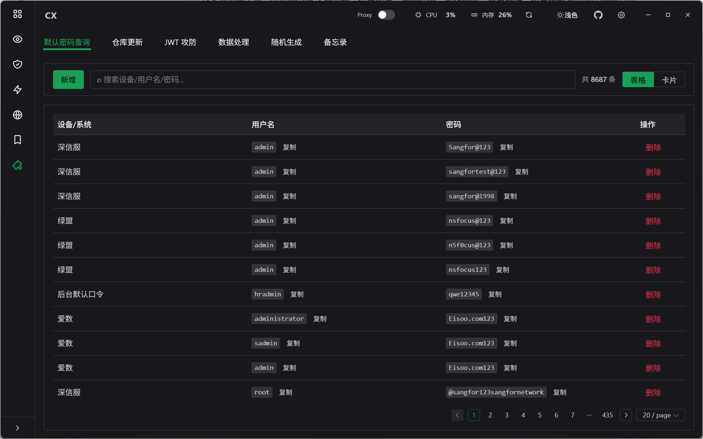

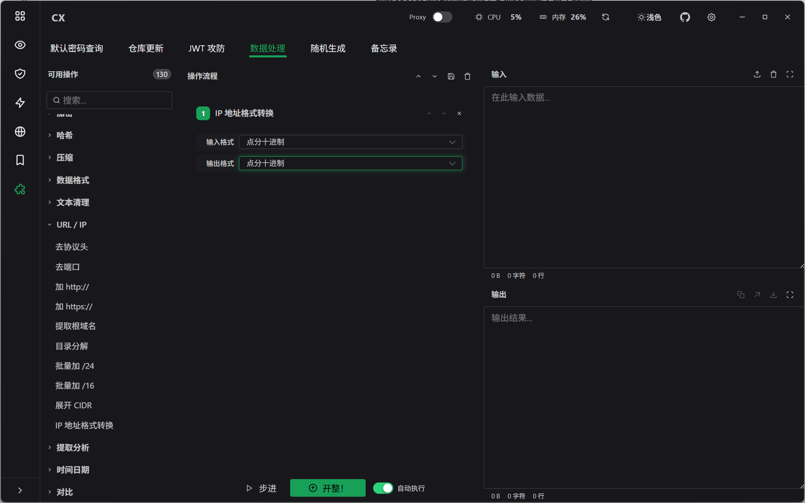


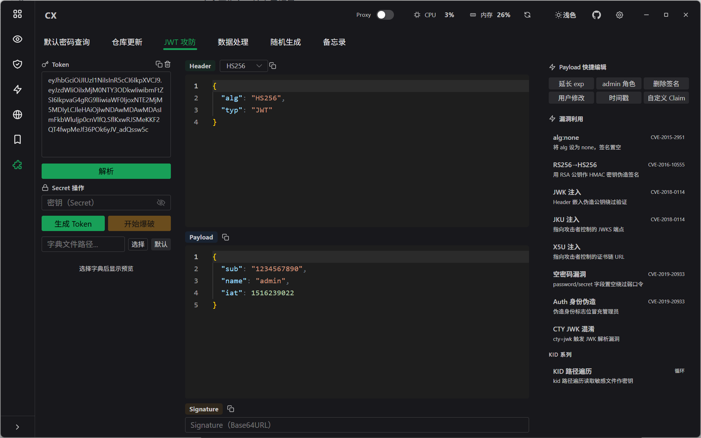


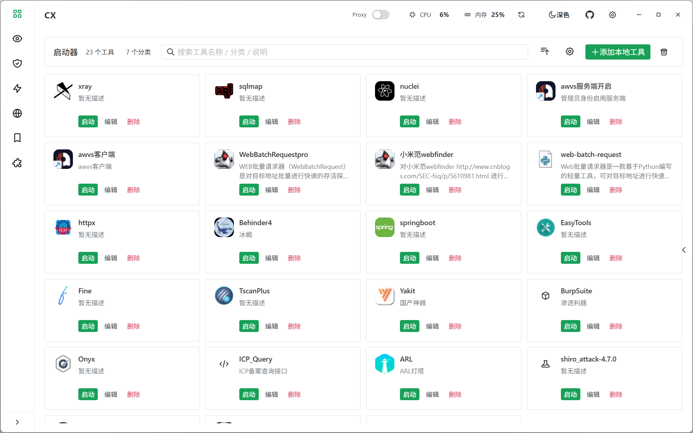


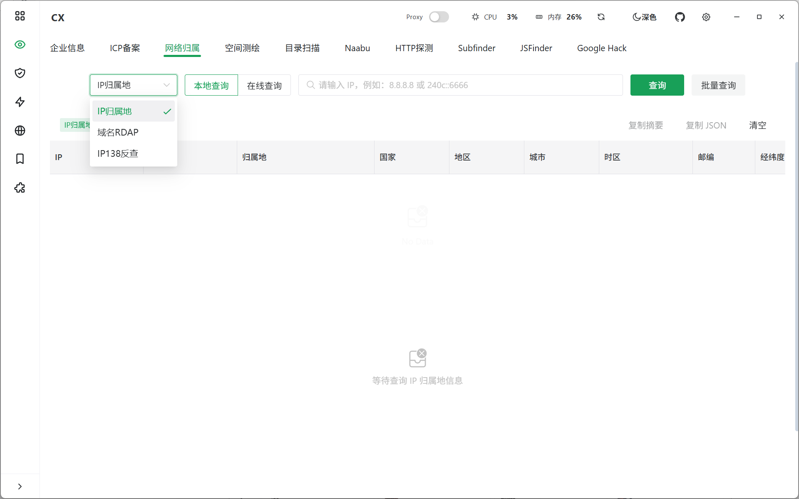

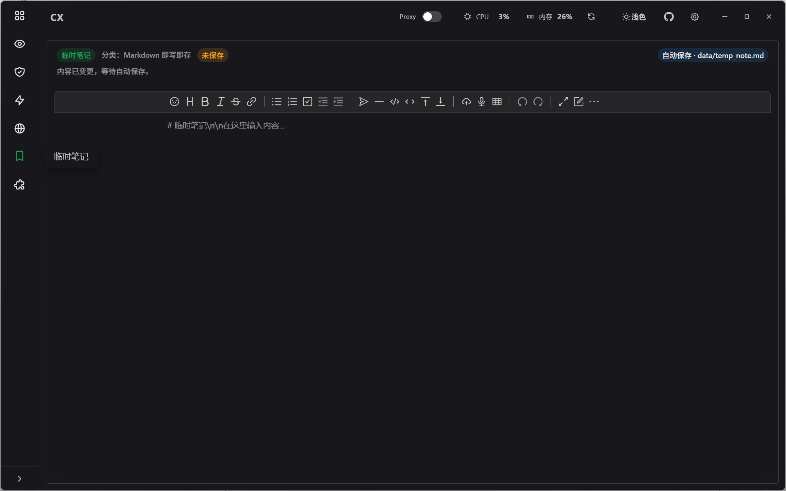

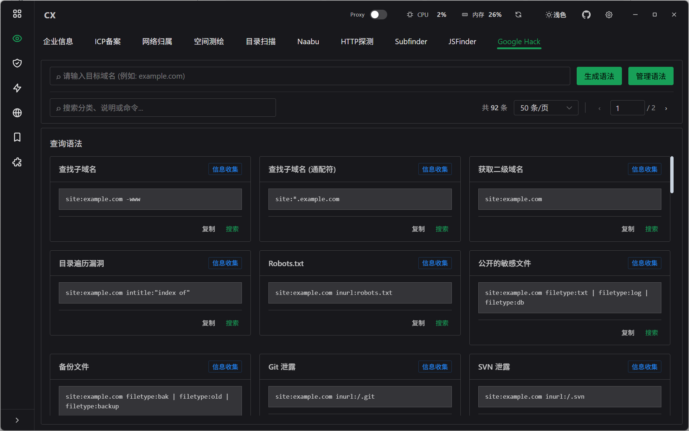


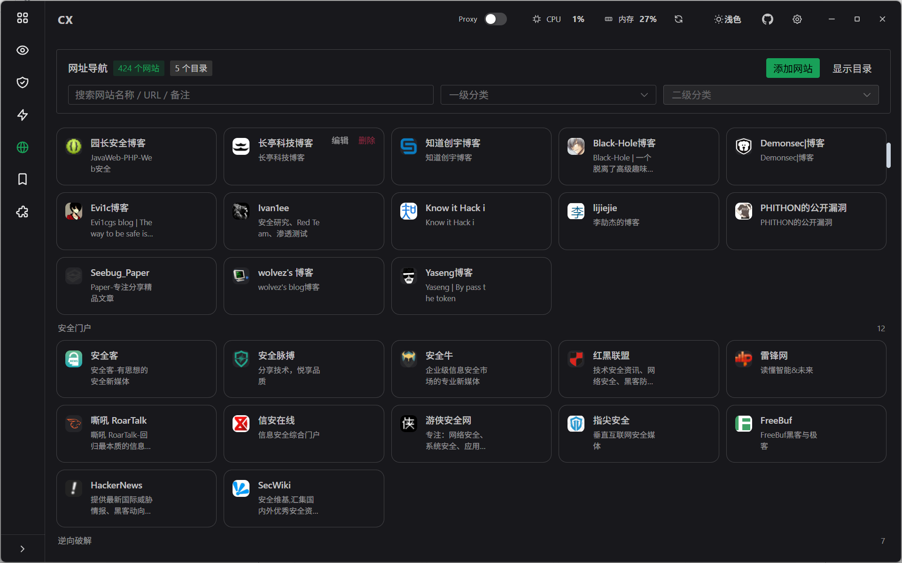


## 3. 核心能力详解

### 3.1 信息收集

| 功能 | 说明 |
|---|---|
| **企业信息** | 爱企查工商数据，股东与对外投资查询 |
| **ICP备案** | 网站 / APP / 小程序 / 快应用备案查询 |
| **网络归属** | IP归属地、域名RDAP查询 |
| **空间测绘** | FOFA / Quake / Hunter三大引擎聚合 |
| **目录扫描** | 字典扫描 + 备份文件探测，支持历史复用 |
| **Naabu** | 端口发现 + 服务识别 + 结果联动 |
| **HTTP探测** | 可达性、标题指纹、跳转识别 |
| **Subfinder** | 被动子域名枚举（基于 subfinder v2.14.0） |
| **JSFinder** | JS资源采集 + 敏感字段提取 + API风险探测 |
| **Google Hack** | 搜索引擎语法检索 |

### 3.2 漏洞管理

| 功能 | 说明 |
|---|---|
| **漏洞检测** | POC管理 + Nuclei扫描任务编排 |
| **Repeater** | 请求重发与调试 |

### 3.3 攻防赋能

| 功能 | 说明 |
|---|---|
| **反弹Shell** | 多环境反弹Shell命令生成（Linux / Windows / Python / PHP / Java / Perl / Ruby / Go / Powershell / Bash / nc 等） |
| **杀软识别** | 基于进程列表识别 AV / EDR 产品（Windows Defender / 卡巴斯基 / 麦咖啡 / 赛门铁克 / 火绒 / 360 等） |
| **补丁检测** | 基于 systeminfo / QFE 文本识别缺失候选补丁 |
| **Java编码** | Runtime.exec Payload 生成 |
| **AK泄露检测** | 多平台 AK / Token / Secret 校验（阿里云 / 腾讯云 / 百度云 / AWS / GCP / Azure / Google Maps / 高德 /等 |
| **口令爆破** | 16+ 协议弱口令（SSH / FTP / MySQL / MSSQL / RDP / Redis / MongoDB / PostgreSQL / SMB / Telnet / VNC / Memcached / Elasticsearch / Kerberos / SMTP / POP3） |
| **Dumpall** | .DS_Store / .git / .svn 泄漏利用与源代码恢复 |


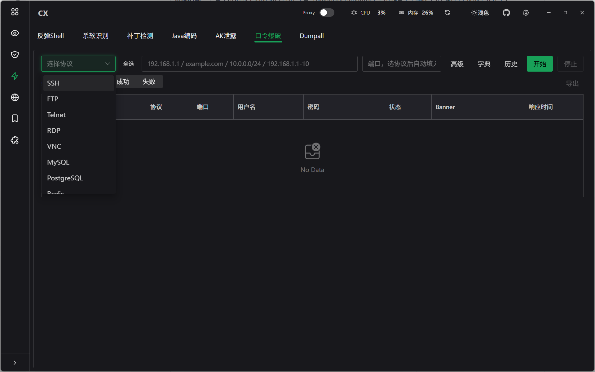


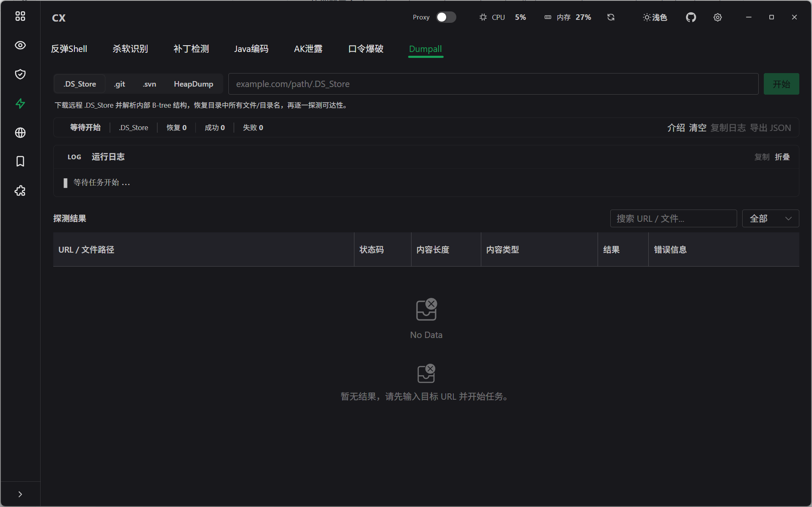


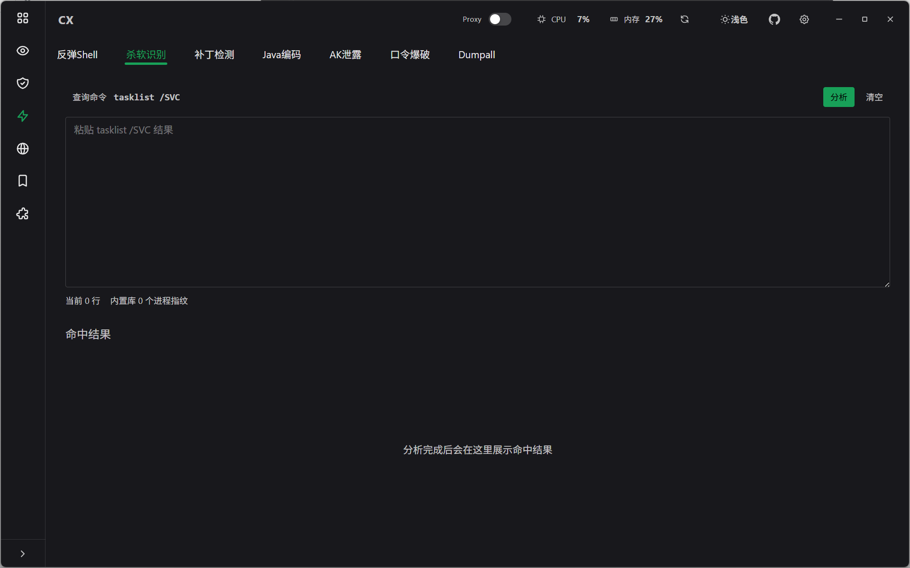


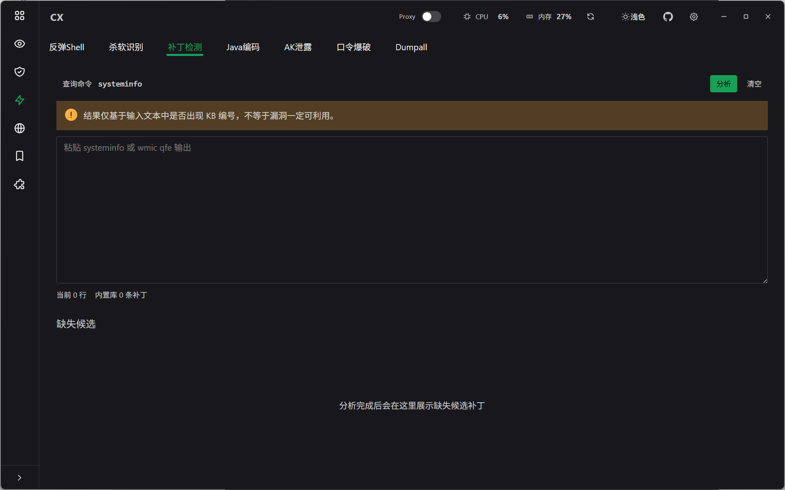


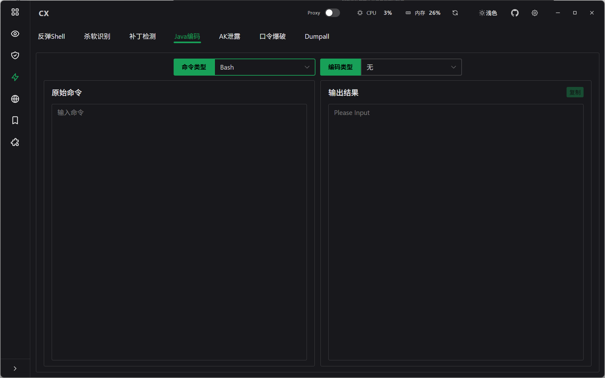

### 3.4 应急响应

| 功能 | 说明 |
|---|---|
| **Web日志分析** | 攻击规则匹配 + AI辅助研判 + 可疑IP统计 |
| **流量分析** | PCAP文件解析 + 流量会话 + AI辅助分析 |
| **Windows日志** | EVTX解析 + 内置告警规则 + 自定义规则 |
| **Webshell检测** | 静态特征检测 + 动态行为检测 + AI辅助判断 |
| **代码审计** | 规则扫描 + AI辅助审计 |

### 3.5 数据处理（CyberChef 本地替代）

**数据处理** 是 ChiXiao 的瑞士军刀模块，提供 **100+ 管道式操作**，支持拖拽串联、多步骤连续处理。

#### 编码 / 解码

| 操作 | 说明 |
|---|---|
| Base64 / Base32 / Base58 / Base62 / Base85 / Base91 | 各种进制编码 |
| Hex / Hexdump | 十六进制与可视化Hexdump |
| Binary / Decimal / Octal | 二/十/八进制互转 |
| URL Encode/Decode | URL编码 |
| HTML Entity | HTML实体编码 |
| Unicode Escape/Unescape | Unicode转义 |
| Quoted Printable | 邮件编码 |
| Punycode | 域名国际化编码 |
| 文本编解码（Text Decode/Encode） | 多种字符集转换 |

#### 哈希 / 校验

| 操作 | 说明 |
|---|---|
| MD5 / SHA1 / SHA2-256/384/512 / SHA3-256/512 | 主流哈希 |
| BLAKE2b / BLAKE2s / BLAKE3 | BLAKE系列 |
| GOST / Streebog | 俄罗斯哈希标准 |
| Keccak-256 / Keccak-512 | Ethereum系 |
| CRC-32 / Adler-32 | 校验和 |
| HMAC SHA-256 | 消息认证 |
| NT Hash | Windows NTLM |

#### 加密 / 解密

| 操作 | 说明 |
|---|---|
| AES / DES / 3DES / RC4 / ChaCha20 | 对称加密 |
| XOR / ROT13 / ROT47 | 简单变换 |
| Blowfish | 对称加密 |

#### 压缩 / 解压

| 操作 | 说明 |
|---|---|
| Gzip / Gunzip | GNU压缩 |
| Zlib Deflate/Inflate | Deflate压缩 |
| Bzip2 | bzip2压缩 |
| Raw Deflate/Inflate | 原始Deflate |
| Tar / Untar | 打包归档 |

#### 文本处理

| 操作 | 说明 |
|---|---|
| **Diff（文本对比）** | 字符级/单词级/行级高亮对比，新增绿色/删除红色 |
| **Pattern Filter（模式过滤）** | 正则/字符串模式，去除/仅保留/替换三种模式 |
| **Remove special chars（去除特殊字符）** | 可自定义字符集，默认预置常见特殊字符 |
| 大小写 / _swap case_ / Reverse / Sort / Unique | 基础文本操作 |
| Find & Replace / Regular expression | 查找替换 |
| Split / Join with comma / Merge into one line | 行处理 |
| Add / Remove line numbers | 行号操作 |
| To Camel / Snake / Kebab case | 命名格式转换 |
| Drop bytes / Take bytes | 字节截取 |
| Pad lines / Wrap | 行填充与包裹 |

#### 数据提取

| 操作 | 说明 |
|---|---|
| Strings / Lines | 提取字符串/行 |
| Count occurrences | 计数 |
| Extract IP / URL / C segment / domain | 字段提取 |
| IP Format Convert | IP格式转换（点分十进制/十进制/十六进制/八进制） |
| Append /24 / /16 | CIDR扩展 |
| Expand CIDR | CIDR展开 |

#### 格式转换

| 操作 | 说明 |
|---|---|
| **JSON Beautify / Minify** | JSON美化/压缩 |
| **XML Beautify / Minify** | XML美化/压缩 |
| **JavaScript Beautify / Minify** | JS美化/压缩 |
| To Unix Timestamp / From Unix Timestamp | 时间戳互转 |
| To Chinese Uppercase | 金额中文大写 |
| Generate UUID | UUID生成 |
| Remove / Keep Chinese | 中文过滤 |
| Remove protocol / Remove port | URL清洗 |
| Add http:// / Add https:// | URL协议补全 |
| Decompose URL path | URL路径分解 |

#### 特殊处理

| 操作 | 说明 |
|---|---|
| Remove whitespace / Remove null bytes | 空白字符处理 |
| Swap endianness | 端序转换 |

---

### 3.6 JWT 攻防台

| 功能 | 说明 |
|---|---|
| Token 解析 | Header / Payload 自动解析 |
| 签名验证 | 支持 HS256 / HS384 / HS512 / RS256 / RS384 / RS512 / ES256 / ES384 / ES512 |
| 密钥测试 | 支持 HMAC 对称密钥与 RSA/ECDSA 非对称密钥 |
| 常用攻击 | None 算法攻击 / 密钥混淆 / RS/HS 签名切换 |

---

## 4. 产品特点

### 统一入口
把常用安全工具、扫描能力和辅助页面放到统一桌面壳中，减少工具碎片化。

### 本地优先
以本地运行、本地数据和本地配置为核心，避免把日常工作流过度依赖浏览器标签页或云端面板。

### 模块化工作流
从资产摸排、指纹识别、漏洞验证，到流量/日志/代码分析，形成连续闭环。

### 数据处理管道（Pipeline）
数据处理模块支持拖拽操作串联，多步骤连续执行，每一步结果自动接力到下一步，减少复制粘贴。

### 环境变量统一管理
支持集中维护 Python、Java、代理、空间测绘密钥与 AI 服务配置，降低切换成本。

### AI 辅助但不绑死 AI
AI 模型配置可独立维护、切换与测试，适合作为规则研判与分析的辅助能力，而非唯一依赖。

### 单实例运行
内置单实例锁，防止多开导致端口冲突或数据异常。

### 安全存储
敏感信息（API Key、Token、Cookie）AES 加密存储，本地 SQLite 数据库持久化。

---

## 5. 快捷键

| 快捷键 | 功能 |
|---|---|
| `Ctrl + K` | 打开全局功能搜索（支持别名搜索，如输入"企业查询"直达企业信息页） |
| `Ctrl + B` | 折叠 / 展开左侧导航 |

---

## 6. 顶部栏与代理说明

### 顶部栏功能
- 应用品牌与窗口控制
- 全局代理开关
- 系统资源监控（CPU / 内存）
- 主题切换（浅色 / 深色 / 跟随系统）
- 设置入口
- 项目仓库入口

### 全局代理
- 顶部栏中的 **Proxy** 开关只控制"是否启用代理"，不负责编辑地址；
- 代理地址在"设置 -> 环境变量配置"中维护；
- 如果未配置代理地址却尝试开启代理，应用会引导你先进入设置填写；
- 关闭代理时，不会清空地址，只是停止通过代理转发请求。

---

## 7. 技术架构

### 前端
- Vue 3 + Vite + TypeScript
- Naive UI（主题单一真源）
- Pinia 状态管理
- Monaco Editor（HTTP/YAML编辑）
- Vditor（Markdown编辑）

### 后端
- Go 1.24+（无 CGO 纯 Go 依赖）
- Wails v2（WebView2 原生桌面壳）
- 现代密码学库（bcmul / aes / chacha20 等）

### 数据层
- 本地 SQLite（modernc.org/sqlite，纯 Go 无 CGO）
- AES 加密存储敏感字段

### 外部工具集成
nuclei / subfinder / naabu / httpx / dirsearch / chromedp 等

### 项目结构

```
ChiXiao/
├─ frontend/                # Vue 3 前端
│  ├─ src/
│  │  ├─ components/      # 通用组件
│  │  ├─ pages/           # 页面级功能模块（含 Emergency 应急响应子目录）
│  │  ├─ ui/              # AppShell / TopBar / SideNav 等壳层 UI
│  │  └─ stores/          # Pinia 状态管理
├─ backend/                 # Go 服务层
│  ├─ services/           # Wails 绑定服务（30+ 服务文件，约 34000 行）
│  ├─ config/             # 配置读写
│  ├─ models/             # 数据模型
│  └─ brute_protocols/    # 口令爆破协议实现
├─ data/                    # 本地运行数据
├─ main.go                  # Wails 入口
└─ README.md
```

---

## 8. 快速开始

### 运行环境
- Windows 10/11 x64
- WebView2 运行时（Wails 自动绑定）

### 使用方式
下载发布版本并解压后即可运行。

```
ChiXiao/
├── ChiXiao.exe
└── data/
    ├── data.db
    └── GeoLite2-City.mmdb   （可选，用于 IP 地理位置）
```

---

## 9. 开发环境

### 依赖要求
- Go：1.24+
- Node.js：18+
- Wails CLI：`go install github.com/wailsapp/wails/v2/cmd/wails@latest`


---

## 10. 更新日志

### v2.x 新增功能

- **数据处理（CyberChef 增强版）**
  - 字符级 Diff 对比（`<ins>`/`<del>` HTML 高亮，绿色新增/红色删除）
  - 单词级 / 行级 Diff 对比粒度
  - **Pattern Filter 模式过滤**（正则/字符串 × 去除/仅保留/替换）
  - **Remove special chars 可自定义字符集**
  - IP Format Convert 下拉框中文化（点分十进制/十进制/十六进制/八进制）
  - JSON / XML / JavaScript 美化与压缩（带示例输入自动填充）
  - 时间日期操作自动填充示例输入
  - **输出接力按钮**（一键将输出推入输入区）
  - 左侧分类栏默认折叠

- **左侧导航重构**
  - 8 大模块统一入口
  - 别名搜索支持（如输入"企业查询"直达目标页面）
  - 分类列表 / 收藏区默认折叠

- **JWT 攻防台**
  - 更名（JWT工具 → JWT攻防台）
  - 移除使用说明和算法标签，界面更简洁

- **工具箱增强**
  - 工具市场安装模态框
  - 批量安装支持

- **口令爆破（Brute Crack）**
  - 支持 16+ 协议弱口令检测
  - 协议覆盖：SSH / FTP / MySQL / MSSQL / RDP / Redis / MongoDB / PostgreSQL / SMB / Telnet / VNC / Memcached / Elasticsearch / Kerberos / SMTP / POP3

- **AK 泄露检测（Credential Lab）**
  - 覆盖阿里云 / 腾讯云 / 百度云 / AWS / GCP / Azure / Google Maps  等 

- **应急响应模块**
  - Web 日志分析（攻击规则 + AI 辅助研判）
  - PCAP 流量分析（会话 + 时间线 + AI 辅助）
  - Windows 日志 EVTX 解析（内置规则 + 自定义规则）
  - Webshell 检测（静态 + 动态 + AI 辅助）
  - 代码审计（规则 + AI 辅助）

- **存储与安全**
  - 从 JSON 迁移到 SQLite
  - 敏感字段 AES 加密存储
  - 单实例运行锁

---

## 12. License

MIT
